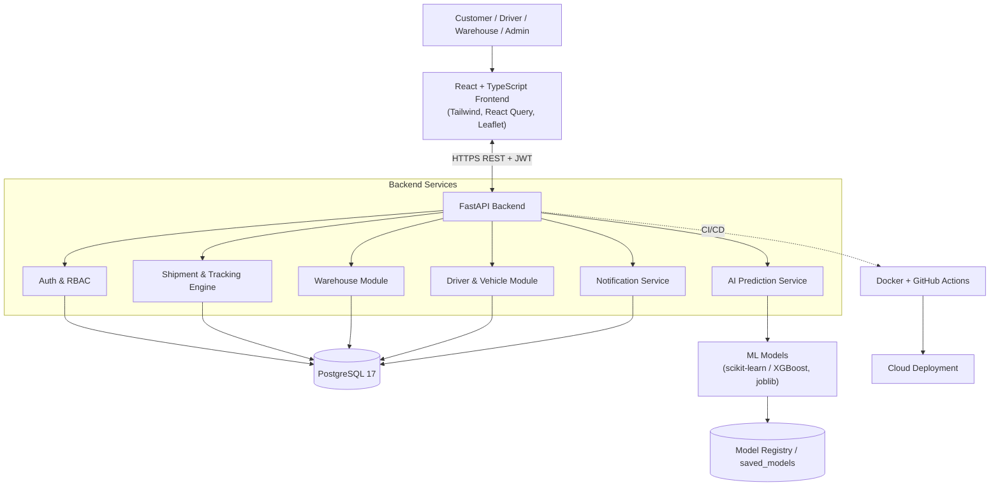
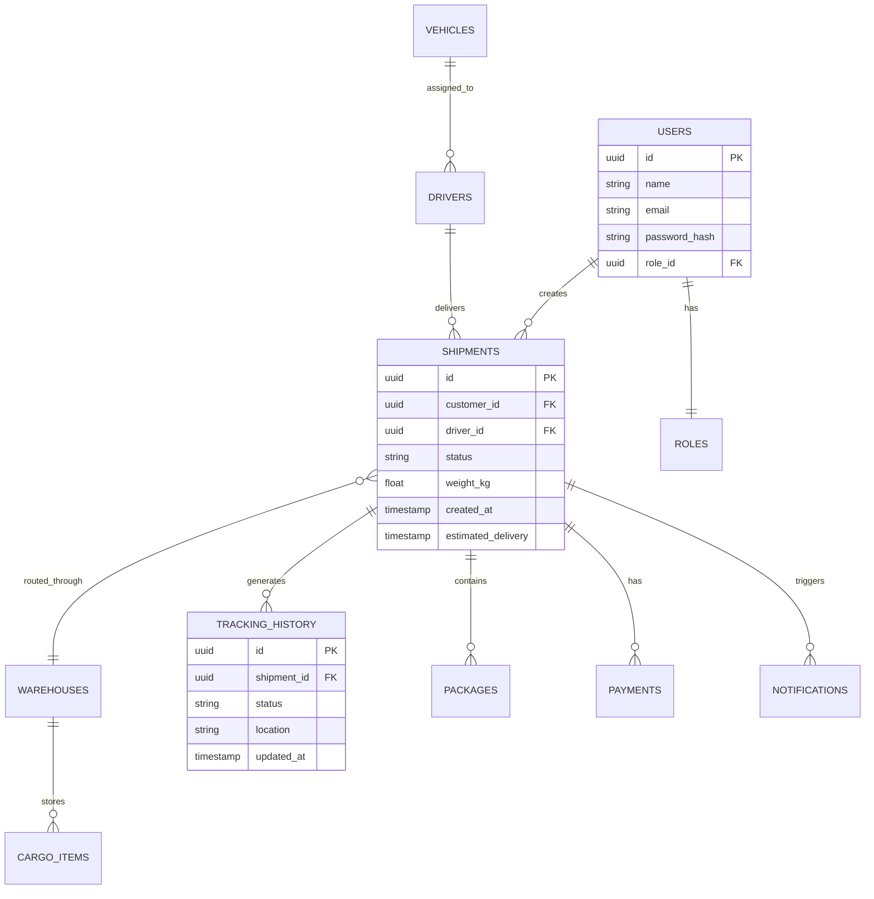
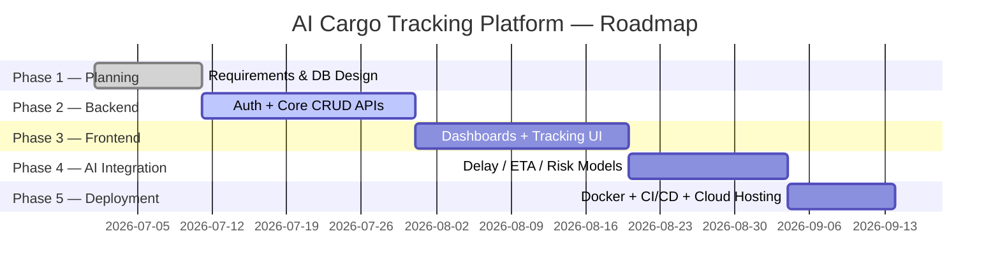

<div align="center">

# 🚚 AI Cargo Tracking Platform

### *An Intelligent End-to-End Logistics & Cargo Management Platform*


**A production-style, full-stack logistics ecosystem — shipment management, real-time tracking, warehouse & fleet operations, and AI-driven predictive analytics — engineered as an academic capstone in Artificial Intelligence & Data Science.**

[Overview](#-1-project-overview) • [Architecture](#-4-system-architecture) • [Tech Stack](#-5-technology-stack) • [Database](#-7-database-design) • [AI Modules](#-9-artificial-intelligence-modules) • [Roadmap](#-13-development-roadmap) • [Setup](#-14-getting-started)

</div>

---

## 📑 Table of Contents

1. [Project Overview](#-1-project-overview)
2. [Problem Statement & Motivation](#-2-problem-statement--motivation)
3. [Objectives & Scope](#-3-objectives--scope)
4. [System Architecture](#-4-system-architecture)
5. [Technology Stack](#-5-technology-stack)
6. [User Roles & Permissions](#-6-user-roles--permissions)
7. [Database Design](#-7-database-design)
8. [API Design](#-8-api-design)
9. [Artificial Intelligence Modules](#-9-artificial-intelligence-modules)
10. [Dashboards & UX](#-10-dashboards--ux)
11. [Security Architecture](#-11-security-architecture)
12. [Testing Strategy](#-12-testing-strategy)
13. [Development Roadmap](#-13-development-roadmap)
14. [Getting Started](#-14-getting-started)
15. [Project Structure](#-15-project-structure)
16. [Learning Outcomes](#-16-learning-outcomes)
17. [Future Enhancements](#-17-future-enhancements)
18. [Author & Acknowledgements](#-18-author--acknowledgements)
19. [License](#-19-license)

---

## 📖 1. Project Overview

The **AI Cargo Tracking Platform** simulates a real-world logistics ecosystem comparable to modern cargo and courier networks. It combines classical full-stack engineering — authentication, relational data modeling, REST APIs, and role-based dashboards — with an applied **machine learning layer** that predicts delays, estimates delivery windows, scores shipment risk, and forecasts demand.

This is deliberately **not a CRUD tutorial project**. It is architected the way a production logistics system would be: modular services, normalized schemas, typed contracts between frontend and backend, and an ML inference layer that is decoupled from the core transactional system so it can be retrained and redeployed independently.

> **Academic framing:** This project is developed as a capstone-style demonstration of applied AI & Data Science within a full-stack engineering context, integrating software engineering discipline (architecture, testing, security) with applied ML (supervised learning, feature engineering, model evaluation).

### Why this project matters as a portfolio piece

| Dimension | What it demonstrates |
|---|---|
| **Systems thinking** | Multi-role platform with distinct data flows per actor (customer, driver, warehouse, admin) |
| **Applied ML** | Real predictive tasks (delay, ETA, risk, demand) — not toy datasets |
| **Engineering rigor** | RBAC, input validation, normalized schema, CI/CD, containerization |
| **Product sense** | Dashboards, notifications, invoices — outcomes a real user would need |

---

## 🎯 2. Problem Statement & Motivation

Modern logistics networks handle millions of shipments daily across fragmented systems — customer-facing tracking, warehouse inventory, fleet dispatch, and back-office analytics are often siloed. Delays are typically detected *after* they occur rather than predicted in advance, and warehouse/fleet decisions are frequently made reactively rather than on forecasted demand.

**This project addresses that gap at a learning scale** by building a unified platform where:

- Every shipment has a single source of truth from booking to delivery.
- Predictive models flag delay risk *before* it happens, not after.
- Warehouse and fleet operations are informed by forecasted, not just historical, demand.

### Real-World Inspiration

Design patterns are studied from established logistics platforms — **DHL, FedEx, UPS, Blue Dart, Delhivery, and Maersk** — not to clone their products, but to understand how tracking states, warehouse hand-offs, and fleet dispatch are modeled in production-grade systems.

---

## 🎯 3. Objectives & Scope

### Primary Objectives

- [ ] Build a professional, modular full-stack web application
- [ ] Design a normalized relational database for logistics operations
- [ ] Implement secure, role-based REST APIs
- [ ] Build real-time shipment tracking with full status history
- [ ] Build responsive, role-specific dashboards
- [ ] Integrate supervised ML models into a live backend service
- [ ] Containerize and deploy a production-style application with CI/CD

### In Scope (v1.0)

Authentication & RBAC · Shipment lifecycle management · Tracking history · Warehouse & inventory operations · Driver & vehicle management · Notifications · AI delay/ETA/risk prediction · Analytics dashboards

### Out of Scope (v1.0) — Reserved for Future Work

Live GPS/IoT integration · Payment gateway processing · Native mobile apps · Multi-language localization

---

## 🏗 4. System Architecture

The platform follows a **layered, service-oriented architecture** — a thin presentation layer, a stateless API layer, a persistence layer, and a decoupled ML inference layer that the backend calls as an internal service.



**Design principle:** the **AI Prediction Service** is called by the backend as an internal module but is trained, versioned, and evaluated independently in `/ml`, so model iteration never requires redeploying the whole API — the same discipline used in real MLOps pipelines.

---

## 🛠 5. Technology Stack

| Layer | Technology | Rationale |
|---|---|---|
| **Frontend** | React 19, TypeScript, Tailwind CSS, React Router, Axios, React Query, Chart.js, Leaflet | Type safety, cache-aware data fetching, and map-based tracking UX |
| **Backend** | Python, FastAPI, SQLAlchemy, Pydantic, JWT, Alembic | Async performance, auto-generated OpenAPI docs, typed request/response schemas |
| **Database** | PostgreSQL 17 | ACID compliance, strong relational integrity for logistics transactions |
| **AI/ML** | Pandas, NumPy, Scikit-learn, XGBoost, Joblib | Industry-standard tabular ML stack, gradient boosting for tabular delay/risk prediction |
| **DevOps** | Docker, GitHub Actions, Render/Railway → AWS/Azure | Reproducible environments, automated build/test/deploy pipeline |

---

## 👥 6. User Roles & Permissions

<table>
<tr><th>Role</th><th>Key Capabilities</th></tr>
<tr>
<td><b>👤 Customer</b></td>
<td>Register/Login · Create shipment · Live tracking · Shipment history · Download invoice (PDF) · Notifications</td>
</tr>
<tr>
<td><b>🚛 Driver</b></td>
<td>View assigned deliveries · Update delivery status · Upload proof-of-delivery · Report delivery issues</td>
</tr>
<tr>
<td><b>🏢 Warehouse Staff</b></td>
<td>Receive/dispatch cargo · Manage inventory · Scan packages (QR/barcode) · Update storage status</td>
</tr>
<tr>
<td><b>👨‍💼 Administrator</b></td>
<td>Full dashboard · Manage users/drivers/warehouses/vehicles/shipments · System reports · AI analytics console</td>
</tr>
</table>

Access control is enforced via **Role-Based Access Control (RBAC)** at the API layer — every endpoint declares its permitted roles, and JWT claims are validated on every request, not just at login.

---

## 🗄 7. Database Design

### Core Entity-Relationship Model



### Planned Tables

`Users` · `Roles` · `Shipments` · `Shipment_Status` · `Tracking_History` · `Warehouses` · `Drivers` · `Vehicles` · `Cargo_Items` · `Packages` · `Notifications` · `Payments` · `Audit_Logs`

**Normalization approach:** the schema targets **3NF** — shipment status is tracked as an append-only `Tracking_History` log (never overwritten), which doubles as the ground-truth training data for the delay-prediction model.

---

## 🔌 8. API Design

RESTful, versioned (`/api/v1/`), documented automatically via FastAPI's OpenAPI/Swagger UI.

| Method | Endpoint | Description | Role |
|---|---|---|---|
| `POST` | `/api/v1/auth/register` | Register a new user | Public |
| `POST` | `/api/v1/auth/login` | Authenticate, issue JWT | Public |
| `POST` | `/api/v1/shipments` | Create a new shipment | Customer |
| `GET` | `/api/v1/shipments/{id}/track` | Real-time tracking + history | Customer |
| `PATCH` | `/api/v1/driver/deliveries/{id}` | Update delivery status | Driver |
| `POST` | `/api/v1/warehouse/inventory/scan` | Scan package in/out | Warehouse Staff |
| `GET` | `/api/v1/admin/reports/analytics` | System-wide analytics | Admin |
| `GET` | `/api/v1/ai/predict/delay/{shipment_id}` | Delay probability | Admin / Internal |
| `GET` | `/api/v1/ai/predict/eta/{shipment_id}` | Estimated delivery time | Customer / Admin |

All error responses follow a consistent schema: `{ "error_code": "...", "message": "...", "details": {...} }`, making frontend error-handling predictable.

---

## 🤖 9. Artificial Intelligence Modules

| Module | Task Type | Candidate Algorithms | Key Features |
|---|---|---|---|
| **Shipment Delay Prediction** | Binary classification | Logistic Regression, Random Forest, **XGBoost** | Distance, weather flag, warehouse load, carrier history |
| **ETA Estimation** | Regression | Random Forest Regressor, XGBoost Regressor | Route distance, historical transit time, current backlog |
| **Risk Scoring** | Classification / scoring | Gradient Boosting | Cargo type, value, route risk history, handling flags |
| **Demand Forecasting** | Time-series regression | XGBoost, seasonal baselines | Historical volume, seasonality, region |
| **Warehouse Optimization** | Rule-based + ML-assisted | Capacity-aware heuristics + regression | Current load, incoming volume, warehouse capacity |
| **Route Optimization** *(future)* | Combinatorial optimization | Graph-based / OR-Tools | Live traffic, multi-stop constraints |

**Evaluation discipline:** each classifier is benchmarked on precision/recall/F1 (not just accuracy, given class imbalance in "delayed" vs "on-time" shipments), and regressors on MAE/RMSE against held-out time-based splits — never a random shuffle split, since logistics data is temporally dependent.

Models are trained in `/ml/notebooks`, exported via `joblib`, versioned in `/ml/saved_models`, and served through a dedicated inference module so the FastAPI backend never re-trains at request time.

---

## 📊 10. Dashboards & UX

| Dashboard | Highlights |
|---|---|
| **Customer** | Shipment overview, live map (Leaflet), delivery timeline, notification center |
| **Driver** | Assigned deliveries, daily schedule, proof-of-delivery upload, route summary |
| **Warehouse** | Incoming/outgoing cargo, inventory levels, storage capacity gauges |
| **Admin** | User/fleet/warehouse management, revenue, AI insights panel, exportable reports |

Charts are rendered with **Chart.js**; live location/route views use **Leaflet**. Every dashboard is built mobile-responsive first using Tailwind's utility system.

---

## 🔐 11. Security Architecture

- JWT-based authentication with short-lived access tokens + refresh tokens
- Password hashing (bcrypt/argon2)
- Role-Based Access Control (RBAC) enforced server-side on every route
- Pydantic-based request validation & sanitization
- Protected/private routes on the frontend (route guards)
- Secrets managed via environment variables, never committed
- API rate limiting *(planned, Phase 5)*

---

## 🧪 12. Testing Strategy

| Type | Tooling (suggested) | Coverage Target |
|---|---|---|
| Unit Tests | Pytest | Services, ML inference wrappers |
| API Tests | Pytest + httpx | All REST endpoints, auth flows |
| Integration Tests | Pytest + test containers | DB + API interaction |
| Frontend Tests | Vitest / React Testing Library | Components, hooks |
| End-to-End | Playwright / Cypress | Critical user journeys (booking → tracking → delivery) |

---

## 📅 13. Development Roadmap



| Phase | Deliverables |
|---|---|
| **1 — Planning** | Requirements analysis, repo setup, folder structure, DB schema |
| **2 — Backend** | FastAPI services, PostgreSQL integration, auth, CRUD APIs |
| **3 — Frontend** | React app, auth flows, role dashboards, live tracking UI |
| **4 — AI Integration** | Delay prediction, ETA estimation, analytics wiring |
| **5 — Deployment** | Dockerization, CI/CD pipeline, cloud hosting, monitoring |

---

## ⚙️ 14. Getting Started

```bash
# Clone the repository
git clone https://github.com/<your-username>/AI-Cargo-Tracking.git
cd AI-Cargo-Tracking

# Backend setup
cd backend
python -m venv venv && source venv/bin/activate
pip install -r requirements.txt
alembic upgrade head
uvicorn app.main:app --reload

# Frontend setup
cd ../frontend
npm install
npm run dev

# Full stack via Docker
docker compose up --build
```

> Environment variables (`DATABASE_URL`, `JWT_SECRET`, etc.) should be defined in a `.env` file at the project root — see `.env.example` once added.

---

## 📂 15. Project Structure

```text
AI-Cargo-Tracking/
│
├── frontend/                  # React + TypeScript client
│
├── backend/
│   ├── app/
│   ├── api/                   # Route handlers, versioned
│   ├── models/                 # SQLAlchemy ORM models
│   ├── schemas/                 # Pydantic request/response schemas
│   ├── services/                 # Business logic layer
│   ├── database/                  # DB session, migrations config
│   ├── middleware/                  # Auth, logging, error handling
│   ├── utils/
│   └── main.py
│
├── ml/
│   ├── datasets/
│   ├── notebooks/               # EDA + model training notebooks
│   ├── training/                # Training scripts
│   ├── saved_models/              # Versioned model artifacts (joblib)
│   └── inference/                  # Serving layer called by backend
│
├── docs/                          # Architecture notes, ADRs, diagrams
├── docker/                          # Dockerfiles, compose configs
├── tests/                            # Unit, integration, e2e tests
├── scripts/                            # DB seeding, utility scripts
├── README.md
└── LICENSE
```

---

## 🎓 16. Learning Outcomes

Completing this project demonstrates practical, portfolio-ready competence in:

**Software Engineering** — Full-stack architecture · REST API design · Database engineering · Auth & RBAC · Docker · CI/CD · Git workflows

**Applied AI/ML** — Feature engineering on tabular logistics data · Model selection & evaluation (classification + regression) · Model versioning & serving · Time-aware validation

**Product & Systems Thinking** — Multi-role system design · Real-time state tracking · Dashboard/UX design for distinct user personas

---

## 📈 17. Future Enhancements

| Category | Enhancement |
|---|---|
| Mobile | Native mobile app (React Native / Flutter) |
| IoT | Live GPS device integration for fleet tracking |
| Scanning | Barcode & QR-based warehouse scanning |
| Payments | Payment gateway integration |
| Notifications | Email + SMS delivery notifications |
| Accessibility | Multi-language support, dark mode |
| AI | Conversational AI assistant for customer support |
| Optimization | Live route optimization using graph algorithms |

---

## 👨‍💻 18. Author & Acknowledgements

**Hemnath KK**
B.Tech — Artificial Intelligence and Data Science
V.S.B. Engineering College, Karur, Tamil Nadu (2023–2027)

*Building production-style, AI-integrated full-stack applications as part of an ongoing capstone portfolio spanning full-stack engineering, applied machine learning, and systems design.*

Design references and domain research drawn from publicly documented logistics practices at DHL, FedEx, UPS, Blue Dart, Delhivery, and Maersk — used strictly as architectural inspiration, not as a basis for replication.

---

## 📜 19. License

Released under the **MIT License** — see [`LICENSE`](./LICENSE) for details.

<div align="center">

---

*If this project structure was useful as a reference for your own capstone, a ⭐ on the repo is appreciated.*

</div>
